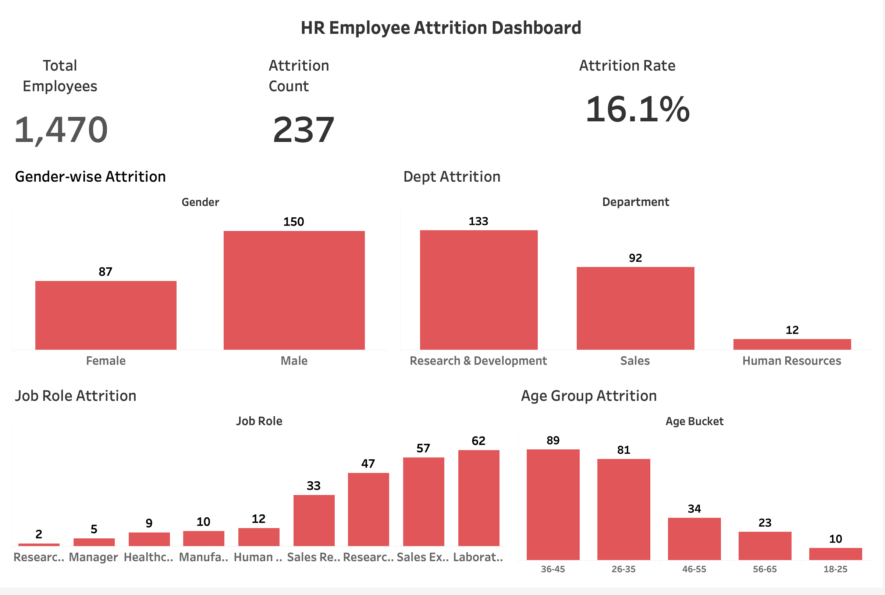

# 📊 HR Employee Attrition Analysis — Tableau Dashboard

## 📌 Project Overview
This project analyzes employee attrition patterns across **gender**, **department**, **job role**, and **age groups** using Tableau.  
The dashboard provides HR teams with actionable insights to identify high-risk employee segments and improve retention strategies.

---

## 📁 Project Files Included
| File | Description |
|------|-------------|
| `HR_Employee_Attrition.twbx` | Tableau packaged workbook with the dashboard |
| `dashboard.png` | Screenshot preview of the dashboard |
| `README.md` | Project documentation (this file) |

---

## 🎯 Business Questions Answered
- Which gender experiences the highest attrition?
- Which departments have the most employee turnover?
- Which job roles show the highest risk?
- What age groups are more likely to leave?
- What is the overall attrition rate?
- How can HR teams reduce attrition?

---

## 📈 Dashboard Visuals
The Tableau dashboard includes:

### ✔ KPI Cards  
- Total Employees  
- Attrition Count  
- Attrition Rate  

### ✔ Breakdown Visuals  
- Gender-wise Attrition  
- Department-wise Attrition  
- Job Role Attrition  
- Age Group Attrition  

Each visualization uses:
- A clean card layout  
- Consistent colors  
- Professional spacing & alignment  
- Clear labels and tooltips  

---

## 🧠 Key Insights
- **Overall Attrition Rate:** ~16.1%  
- **Male employees** show higher attrition than females  
- **Research & Development** has the highest attrition (133 employees leaving)  
- **Sales Executives** and **Laboratory Technicians** show major job-role attrition  
- Employees aged **26–45** show the highest turnover  
- Younger (18–25) and older (56–65) employees have lower attrition  

These insights help HR prioritize retention programs and identify at-risk groups.

---

## 🔧 Tools & Techniques
- Tableau Public / Desktop  
- Calculated Fields (Attrition Flag, Age Buckets)  
- KPI tiles  
- Interactive dashboard  
- Visual storytelling techniques  
- Layout optimization using containers  

---

## 📷 Dashboard Preview

---

## 🚀 How to View the Dashboard
1. Download the `.twbx` file  
2. Open it using **Tableau Public** (Free)  
3. Explore each chart and interact with filters  

---

